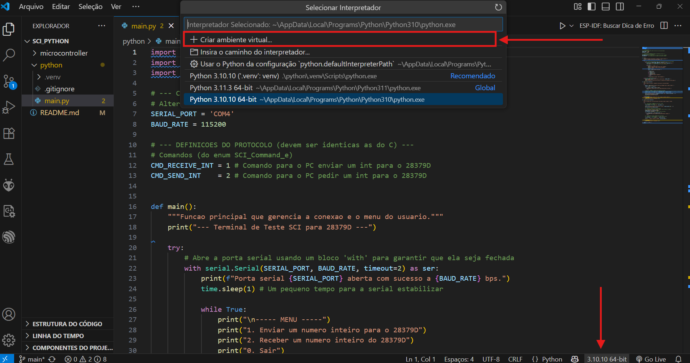

# 📡 Comunicação SCI – TMS320F28379D + Python

Projeto de comunicação serial entre o microcontrolador **TMS320F28379D** e um computador via protocolo SCI, utilizando **firmware em C (CCS)** e **interface de controle em Python (VSCode)**.

Permite o **envio** e a **recepção** de inteiros (`int16_t`) usando um protocolo simples.

---

## 🗂️ Estrutura do Projeto

```
sci_python/
├── images/             # Imagens usadas no README
│   └── VSCodePrint.png
├── microcontroller/    # Projeto CCS para o TMS320F28379D
│   ├── .project
|   ├── ...
│   └── main.c
├── python/             # Código Python para executar no PC
│   └── main.py
└── README.md
```

---

## 🧰 Requisitos

### PC (Python)

* Python 3.11 ou superior
* Visual Studio Code (VSCode)
* Extensão Python instalada no VSCode
* Driver da porta COM (FTDI, XDS, etc.)

### DSP (Firmware)

* Code Composer Studio (CCS) v12
* Lauchpad 28379D

---

## 🔧 Passo a Passo

### 1. Obter o Projeto (📌 Faça o Fork)

1. Acesse:
   👉 [`https://github.com/Pguilhermem/sci_python`](https://github.com/Pguilhermem/sci_python)

2. Clique no botão `Fork`.

3. Depois do fork, clone o repositório:

```bash
git clone https://github.com/seuusuario/sci_python.git
cd sci_python
```

Substitua `seuusuario` pelo seu nome de usuário no GitHub.

---

## ⚙️ Parte 1 – Executar Firmware no TMS320F28379D (CCS)

### 1. Abrir o CCS e Importar o Projeto

1. No CCS, vá em `File > Import...`.
2. Selecione a opção:
   ✅ `Code Composer Studio > CCS Projects`
3. Em `Select Search-directory`, clique em `Browse...` e selecione a pasta:
   `sci_python/microcontroller/`
4. **Desmarque** a opção `Copy projects into workspace`.
5. Clique em `Finish`.

### 2. Compilar e Gravar o Código

1. Conecte a placa ao PC.
2. Vá em `Project > Build Project` ou clique no martelo (🔨).
3. Vá em `Run > Debug` para carregar o firmware.
4. Clique no botão `Resume (F8)` para rodar o código.

---

## 🖥️ Parte 2 – Executar a Interface Python (VSCode)

### 1. Abrir o Projeto no VSCode

Abra a pasta do projeto no VSCode:

- `Arquivo > Abrir Pasta...`  
- Selecione a pasta onde está o script `main.py`

---

### 3. Criar Ambiente Virtual

Você pode criar o ambiente **graficamente ou pelo terminal**:

#### ✅ Opção 1: Pelo VSCode (modo gráfico)

1. Clique na aba inferior onde aparece o número da versão do Python (canto inferior direito do VSCode).
2. Uma lista de ambientes será exibida. Clique em **"Criar Ambiente"** ou selecione **Python: Create Environment**.
3. Escolha a opção **Venv** e aguarde a criação do ambiente virtual `.venv`.



#### 🧪 Opção 2: Pelo terminal (modo manual)

Abra o terminal do VSCode:

- Menu: `Terminal > Novo Terminal`
- Ou atalho: `Ctrl + ` (Ctrl + acento grave)

E execute:

```bash
python -m venv .venv
```

Ative o ambiente virtual:

- **Windows (cmd):**
  ```bash
  .venv\Scripts\activate
  ```

- **PowerShell:**
  ```bash
  .venv\Scripts\Activate.ps1
  ```

- **Linux/macOS:**
  ```bash
  source .venv/bin/activate
  ```

---

### 4. Selecionar o Interpretador Python

Após a criação do ambiente virtual:

- Clique novamente no **número da versão do Python** no canto inferior direito do VSCode.
- Selecione o Python localizado em `.venv`

---

### 5. Instalar Dependências

> **⚠️ Esta etapa deve ser feita com o terminal aberto e o ambiente virtual ativado.**

1. Abra o terminal no VSCode:  
   - Menu: `Terminal > Novo Terminal`  
   - Ou atalho: `Ctrl + `

2. Com o ambiente virtual ativo (deve aparecer algo como `(.venv)` no terminal), instale a biblioteca:

```bash
pip install pyserial
```

Se quiser congelar as dependências em um arquivo (opcional):

```bash
pip freeze > requirements.txt
```

---

### 6. Configurar a Porta Serial

Edite a variável `SERIAL_PORT` no início do código:

```python
SERIAL_PORT = 'COM4'  # Altere para a porta COM do seu dispositivo
```

No Windows, consulte a porta no **Gerenciador de Dispositivos > Portas (COM e LPT)**.

---

### 7. Executar o Script

No terminal (com o ambiente virtual ativado), execute:

```bash
python main.py
```

---

## 💻 Interface do Programa

Ao iniciar, o terminal exibirá o seguinte menu:

```
----- MENU -----
1. Enviar um numero inteiro para o 28379D
2. Receber um numero inteiro do 28379D
0. Sair
```

---

## ❗ Problemas Comuns

- **Porta COM incorreta:** Verifique no Gerenciador de Dispositivos.
- **Timeout:** Certifique-se de que o 28379D está ligado e com firmware SCI funcional.
- **Permissão (Linux):** Pode ser necessário rodar `sudo usermod -a -G dialout $USER`.

---

## 📄 Licença

Este projeto é livre para fins educacionais e de testes com o TMS320F28379D.

---
